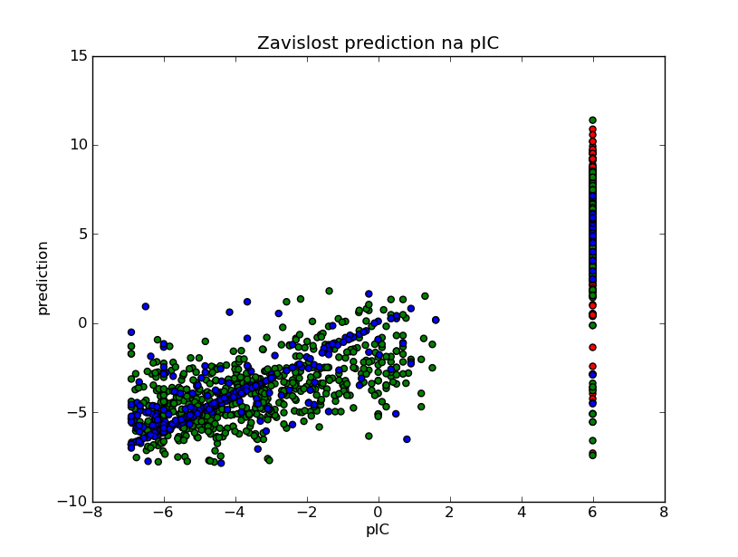

Data mining project 2014
================

This project was created as a fullfilment of a requirement for DataMining subject at ICT Prague.

#### Python Dependencies:
- rdkit
- sklearn
- numpy
- pylab
- cPickle or pickle

## How to use
  Most important part of program is main.py script. It contains of two parts:
- list of Nodes
- main function

  In Node list, there is description of whole program structure.

### Node
Each node consists of its index, name, called function, dependencies and parameters
- Index - it serves for dependency connections. Indices must be unique, but dont have to be ordered
- Name - it must be unique (it is used for pickle file name)
- Function - name of function, which will be called within the node. Structure of inner functions will be described later
- need - (optional), specify indices of nodes, from which data need to be loaded for processing
- needpos - (optional), specify, which of two outputs should be used
- params - (optional), list of parameters for inner function.

__Example:__
```python
	19:Node("divPickerDecoys",processor.DiversePicker,need=[18],needpos=[1],params={"size":300}),
```
### Main function
  It has only two compulsory statements:
- invalidate() - invalidate selected nodes for recomputing (only invalidated and successor nodes are recomputed)
- execute() - select final node. For multiple final nodes, more nodes can be used in one execute.
```python
execute(26,28)
```
---
## New node types
If you want to add new node type, you need to implement its inner function. New function should satisfy this requirements:
- **Location**
  - Preferably in datamining package
- **Input**

  Accepts two arguments:
    - *Output from previous node*
    
    if more than one dependency specified, outputs will be send a array of arrays, but first element will be "multiarray" string
    - *List of parameters*

- **Output**

  if more than one output is required, tuple with two elements can be used. Second element can be accessed by needpos parameter
  
---
    
## Current Workflow
  It uses three inputs of molecules, from ChEMBL and from two .mol2 files.
  
  ChEMBL input in this version isn't working properly because of a problem with urllib2 library,
  which prevent from connecting to ChEMBL webpage. That's why a workaround is implemented - all
  data are already downloaded in the form of JSON. Then all data are being filtered according 
  inhibition values and for the best molecules, its SMILES are downloaded (workaround also here).
  Thanks SMILES structures, we can add to molecules its RDKit representations. For two other inputs,
  RDKit representations are created directly from mol2 format and because of missing pIC50 values,
  arbitrary values are chosen (6 for decoys, -6 for antagonists). Before merging of all molecules
  into one array, activity value (0 for decoys, 1 for antagonists) are added to all molecules.
  Then Fingerprints are created. Then stratified Diversity Pick are conducted according activity
  value, so all molecules are divided into two groups (chosen and not-chosen). Chosen molecules
  is used for Support Vector Machine model training. Not chosen molecules is divided according its
  closeness to two groups - Close and Out. For all three groups (Chosen, Close and Out), their
  pIC value is predicted according the SVM model and all of them are plotted.  

## Evaluation of Current Workflow
  Relatively high number of molecules have been rejected in the workflow. At the start, we have 9396
  molecules from ChEMBL and 39 antagonists and 1448 decoys from .mol2 files. Most of the rejected
  molecules were from ChEMBL database. There is table of reasons and counts of rejects.
  
| Reason | Rejects
|:-------------:|:-------------:
| not IC50 | 6159
| confidence &lt; 7 | 3
| not nM | 946
| unparsable | 0
| &gt; 1 uM | 1067
| redundant | 331
| RDKit error | 16
  
  So at the end of loading procedure, there was 2361 molecules left.
  Six hundread molecules were chosen for model training, rest was divided by their closeness to sample
  with relatively strict cut-off, 814 molecules were labeled too distant and only 947 molecules were
  similar to sample. But all molecules were ploted and plot is displayed here.
  
  
  
  Distant molecules (red dots) are located entirely in cluster at pIC50 = 6 (arbitrary value for decoys
  molecules).
  
## Conclusion

Process of loading molecules are relatively successful, but there are still space for improvements.
Firstly, redundant molecules are being deleted instead averaging or choosing the best. Secondly,
sixteeen molecules were removed because they could be loaded into RDKit format. That's problem of
RDKit, not of the molecules (but they, for example, contains borane spheres with 6-valence carbon).
Assigning of pIC50 values to .mol2 molecules is a little bit controverial, but neccesary (otherwise
we have to delete these molecules).

SVM used for model generation have been run with C = 0.6. This value should be optimized, because
overfitting and underfitting can occur with wrong value of C parameter, but I have not done this
optimalization. Also, different kernel can improve model.

Selection of distant molecules is also controled with not optimized theshold parameter, but current
value is chosen relatively well.

Purpose of this project is to create python program for activity recursion. I have focused on formal
side of the problem, so there wasn't enough time for model optimalization. But with such robust
construction of the program, applications on different problems can be done with ease (lot of useful
nodes are already implemented and easily controled through parameters).
  
So I hope, that you would like this program
  
Petr Hošek     
  
  


